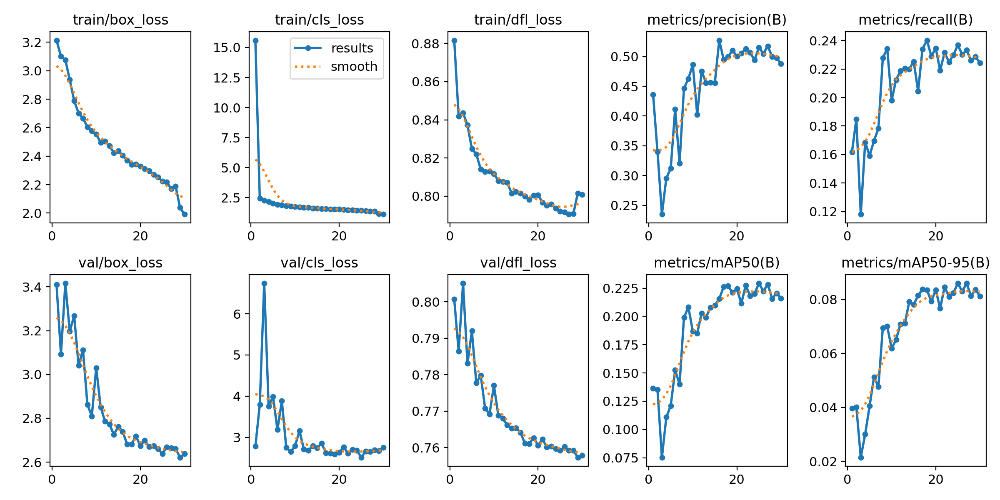

# Детекция и отслеживание мяча в футболе с использованием YOLO

## Введение

Задача детекции мяча на футбольном поле является ключевой для анализа спортивных видео, особенно матчей по футболу. Реальное время для обнаружения и отслеживания мяча может быть крайне важным для создания автоматических систем анализа матчей, которые помогают тренерам, командам и аналитикам извлекать полезную информацию для улучшения тактики игры и проведения статистического анализа. Данная проблема имеет несколько сложностей, таких как динамика игры, изменяющиеся условия освещения, наличие множества игроков и движение камеры.

## Проблематика

Одной из главных сложностей этой задачи является то, что мяч является небольшим объектом, который может быть скрыт игроками, пересекаться с линиями поля и двигаться на большой скорости. Различные углы съемки и изменения освещения дополнительно усложняют процесс обнаружения и отслеживания. Мяч также может находиться в воздухе или отскакивать от различных поверхностей, что затрудняет предсказание его движения на основе предыдущих кадров.

Использование YOLO и других современных архитектур для детекции объектов значительно улучшает точность обнаружения и отслеживания мяча в условиях реальных матчей, где постоянно разворачиваются сложные динамические сцены.

## Обзор файлов

## Директория `notebooks`
### `download_data.ipynb`
- **Назначение:** Этот ноутбук используется для загрузки датасета SoccerNet, включающего данные для задачи gamestate-2024.
- **Основные шаги:**
  - Загрузка данных SoccerNet (тренировочный, валидационный, тестовый и челлендж-сплиты) с помощью `SoccerNetDownloader`.
  - Сохранение данных в локальной директории для дальнейшей обработки.

### `preprocessing_data.ipynb`
- **Назначение:** Этот ноутбук фокусируется на предварительной обработке загруженных изображений и аннотаций.
- **Основные шаги:**
  - Нормализация координат ограничивающих рамок в формат YOLO.
  - Изменение размера изображений до целевого (640x384).
  - Обработка аннотаций для соответствия новым размерам изображений и обеспечения правильного формата для обучения YOLO.

### `fill_empty.ipynb`
- **Назначение:** Этот ноутбук используется для проверки наличия аннотаций для каждого изображения.
- **Основные шаги:**
  - Проверка на наличие отсутствующих файлов аннотаций.
  - Создание пустых файлов аннотаций для изображений, не имеющих аннотаций.

### `display_checking.ipynb`
- **Назначение:** Этот ноутбук позволяет визуально проверять аннотации, наложенные на изображения.
- **Основные шаги:**
  - Загрузка изображения и соответствующих аннотаций.
  - Конвертация аннотаций в формате YOLO обратно в координаты изображения.
  - Отображение изображения с ограничивающими рамками для проверки корректности аннотаций.

## Директория `model`
### `soccernet_model.ipynb`
- **Назначение:** Этот ноутбук фокусируется на обучении и развертывании модели YOLO для детекции и отслеживания мяча в видеозаписях футбольных матчей.
- **Основные шаги:**
  - Обучение модели YOLO с использованием данных SoccerNet с различными методами аугментации, такими как перевороты, масштабирование, трансляция, mixup и мозаика.
  - Отслеживание мяча на последовательности видеокадров.
  - Визуализация истории обнаружений, рисуя траекторию движения мяча по кадрам.
  - Сохранение итогового видео с аннотированной траекторией.

### `data.yaml`
- **Назначение:** Этот файл конфигурации определяет структуру данных для обучения модели YOLO. Он содержит пути к изображениям для обучающей, валидационной и тестовой выборок, а также информацию о классах объектов.
- **Основные параметры:**
  - `train`: Путь к изображениям для обучения, установленный на `../train/images`.
  - `val`: Путь к изображениям для валидации, установленный на `../val/images`.
  - `test`: Путь к изображениям для тестирования, установленный на `../test/images`.
  - `nc`: Количество классов, равное 1 (только для мяча).
  - `names`: Список имен классов, в данном случае `['Ball']`.

### Базовые веса модели `YOLOv11n.pt`
- **Назначение:** Это предобученная модель YOLOv11, которая представляется как самая маленькая версия в серии YOLOv11.
- **Преимущества:** Модель `yolo11n.pt` отличается высокой скоростью инференса, что делает её идеальной для приложений, требующих быстрой обработки видео, таких как отслеживание мяча в реальном времени.

## Установка зависимостей

1. Склонируйте репозиторий или скачайте файлы проекта.
2. Установите необходимые зависимости:
   ```bash
   pip install -r requirements.txt
   ```
3. Загрузите датасет SoccerNet, используя `download_data.ipynb`.

## Обучение модели

Чтобы обучить модель YOLO, следуйте шагам в `soccernet_model.ipynb`, вы можете использовать предобученные веса модели на датасете SoccerNet: `best.pt`.

В данной секции представлены гиперпараметры, используемые для тренировки модели YOLOv11 на наборе данных SoccerNet.

| Параметр         | Значение      | Описание                                               |
|-------------------|---------------|--------------------------------------------------------|
| `data`            | `"data.yaml"` | Путь к файлу конфигурации с метками и путями к данным. |
| `epochs`          | `30`          | Количество эпох для тренировки модели.                 |
| `imgsz`           | `640`         | Размер входных изображений (ширина и высота).          |
| `batch`           | `128`         | Размер батча для тренировки.                           |
| `augment`         | `True`        | Включает аугментацию данных.                           |
| `fliplr`          | `0.5`         | Вертикальное отражение изображений с вероятностью 50%. |
| `scale`           | `0.5`         | Случайное изменение масштаба изображений до 50%.       |
| `translate`       | `0.1`         | Случайное смещение изображения на 10%.                 |
| `mixup`           | `0.2`         | Вероятность применения MixUp аугментации 20%.          |
| `mosaic`          | `0.5`         | Вероятность применения mosaic аугментации 50%.         |
| `hsv_h`           | `0.2`         | Аугментация цветового тона (Hue) в диапазоне 10%.      |
| `hsv_s`           | `0.7`         | Аугментация насыщенности (Saturation) в диапазоне 70%. |
| `hsv_v`           | `0.4`         | Аугментация яркости (Value) в диапазоне 40%.           |
| `dropout`         | `0.05`        | Вероятность отключения нейронов в слое Dropout (5%).   |
| `close_mosaic`    | `5`           | Отключение на последних 5 слоях mosaic аугментации.    |
| `plots`           | `True`        | Включает визуализацию графиков во время тренировки.    |
| `device`          | `[0, 1]`      | Указание на использование GPU 0 и 1 для тренировки.    |

## Результаты

После обучения модель YOLO может эффективно обнаруживать и отслеживать мяч в режиме реального времени на видеозаписях матчей. Движение мяча отслеживается по кадрам, и его траектория визуализируется.

### Видео работы алгоритма детекции и трекинга мяча
Пример на SNGS-180 из датасета SoccerNet-Gamestate `challenge`


Пример на SNGS-171 из датасета SoccerNet-Gamestate `challenge`


Так же вы можете перейти по этой ссылке, где доступны полные видео работы алгоритма: [ссылка на видео](https://disk.yandex.ru/d/S_jPi_7h8TN3DQ)

## Анализ работы модели


### Потери:

- **train/box_loss, train/cls_loss, train/dfl_loss**: Потери на обучающей выборке. 
  - Видно, что все три типа потерь снижаются с ростом числа эпох.
  - Это означает, что модель учится все лучше предсказывать координаты bounding box-ов (box_loss), классифицировать объекты (cls_loss) и определять их ориентацию (dfl_loss).

- **val/box_loss, val/cls_loss, val/dfl_loss**: Потери на валидационной выборке.
  - Наблюдается, что потери на валидационной выборке сначала могут быть не такими плавными, как на тренировочной, и даже могут возрастать. 
  - Это говорит о том, что модель могла начать переобучаться, то есть лучше запоминать тренировочные данные, чем обобщать на новые.
  - Однако, в целом, все три типа потерь на валидационной выборке также демонстрируют тенденцию к снижению, что является хорошим признаком.

### Метрики точности:

- **metrics/precision(B), metrics/recall(B)**: Метрики точности для bounding box-ов (precision - точность, recall - полнота).
  - Видим, что precision и recall улучшаются с ростом числа эпох. 
  - Модель становится более точной в предсказании bounding box-ов.

- **metrics/mAP50(B), metrics/mAP50-95(B)**: Средняя точность (mAP) для bounding box-ов при разных пороговых значениях IoU (Intersection over Union).
  - mAP50 - средняя точность при IoU больше или равно 0.5
  - mAP50-95 - средняя точность при IoU от 0.5 до 0.95
  - Повышение mAP50 и mAP50-95 указывает на улучшение качества обнаружения объектов моделью.

### Основные выводы:

- Модель демонстрирует хорошую динамику обучения.
- Потери на обеих выборках (тренировочной и валидационной) снижаются, что говорит о прогрессе в обучении. 
- Метрики точности также улучшаются, что подтверждает, что модель учится выполнять задачу обнаружения объектов все лучше.
- Однако, следует следить за переобучением модели и при необходимости регулировать процесс обучения, например, уменьшая количество эпох, вводя регуляризацию или изменяя гиперпараметры модели.

### Улучшение модели и трекинга мяча

- **Метод нон-максимум подавления (NMS)**: Использовать метод нон-максимум подавления, чтобы удалить дублирующиеся предсказания в одной и той же рамке, если они пересекаются. Это поможет повысить точность обнаружения объектов.

- **Kalman Filter**: Использование фильтра Калмана для более плавного трекинга объектов между кадрами. Фильтр поможет предсказать положение объекта в следующем кадре, что может улучшить стабильность трекинга.

- **История трекинга**: Вместо использования фиксированного размера для хранения истории трекинга (например, 60 кадров), можно рассмотреть возможность хранения всех точек и использовать методы сглаживания, такие как фильтры Савицкого-Голея или сглаживание по среднему значению, чтобы уменьшить шум в данных трекинга.

- **Фильтрация ложных срабатываний**: Добавить механизм для игнорирования объектов, которые наблюдаются в пределах определенного порога (например, 10 кадров), чтобы избежать случайных ложных срабатываний. Это поможет улучшить стабильность и надежность трекинга.

- **Косинусное расстояние поворота камеры**: Для правильного отслеживания траектории меча, при повороте камеры необходимо учитывать угол, на который она поворачивается, т.к. в этом случае система координат движется вместе с объектом, для этого необходимо учитывать относительное движение мяча и смотрящего за объектом (камерой).

## Заключение

Этот проект демонстрирует современный метод детекции объектов, таких как YOLO, для решения сложных задач видеоанализа. Используя методы аугментации данных и дообучение, можно достичь высокой точности даже в сложных сценариях.
